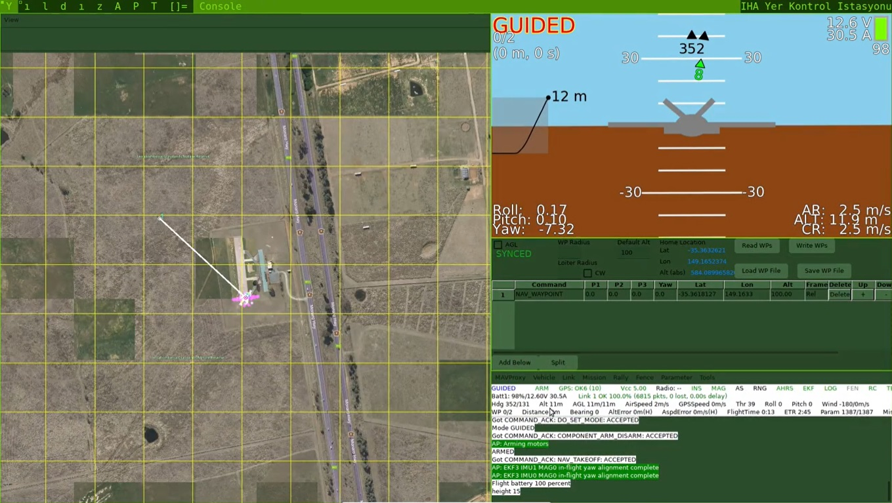

Here's an updated version of your README with a "Special Thanks" section in English at the end:

---

# 🌟 Fatqat/YILDIZ OS: Advanced Ground Control Station + Image Processing Suite 🌟

**Fatqat/YILDIZ OS** is a state-of-the-art GNU/Linux distribution designed to meet all your ground control station needs. With its high-performance and customizable features, Fatqat/YILDIZ OS is capable of handling any UAV (Unmanned Aerial Vehicle) task effectively.

## 📦 Installation:

To set up **Fatqat/YILDIZ OS**, follow these streamlined steps:

1. [Obtain the **Fatqat/YILDIZ OS** ISO file.](https://drive.google.com/file/d/1HhcKLlA97O4HqoEbWRxtf0D6NDskypto/view?usp=sharing)
2. Perform a standard Ubuntu installation using the ISO.
3. Once installed, launch a simulation with the `sim-start` command or connect your vehicle using MAVProxy.

## 🚀 Usage:

You can use **Fatqat/YILDIZ OS** in different modes to perform various tasks.

### Ground Control Station (GCS) Mode:

To start the ground control station, fire up the terminal and type:
```bash
mavproxy.py --master=<YOUR CONNECTION STRING>
```

For example:
```bash
mavproxy.py --master=/dev/ttyUSB0
mavproxy.py --master="com14"
mavproxy.py --master=tcp:192.168.1.1:14550
mavproxy.py --master=udp:192.168.1.1:14550 --master=/dev/ttyUSB0
mavproxy.py --master=/dev/ttyUSB0,57600
mavproxy.py --master=udp:127.0.0.1:14550
mavproxy.py --master=tcp:0.0.0.0:14550
```
[Please check out the wiki page for your very special connection string!](https://ardupilot.org/mavproxy/docs/getting_started/starting.html)

### Typical simulation:

To start a typical drone simulation, fire up the terminal and type:
```bash
sim-baslat
```
Then hit enter!

## 📋 Features:

### 1. **Flight Data**

- Real-time telemetry data monitoring.
- Flight parameters and alerts.
- Graphical data and map integration.

### 2. **Map**

- Interactive map integration.
- Displaying GPS data and waypoints on the map.
- Planning flight routes on the map.

### 3. **Flight Plan**

- Creating and managing flight plans and waypoints.
- Planning tools and optimization options.
- Real-time tracking and management of routes.

### 4. **Configuration**

- Configuring flight control software and hardware settings.
- User-friendly configuration interface.
- Customized setting options.

### 5. **Maintenance**

- Software updates and maintenance tools.
- Sensor calibration and hardware testing.
- User guides and maintenance manuals.

### 6. **Status**

- System status and performance monitoring.
- Alerts and alarm management.
- Status reports and analytical tools.

### 7. **Log**

- Flight data logs and analysis tools.
- Viewing and inspecting log files.
- Performance analysis and reporting.

### 8. **Camera**

- Live video streaming and recording.
- Camera control and settings.
- Image processing and analysis applications.

## 📸 Screenshots:

Here are some screenshots showcasing Fatqat/YILDIZ OS:



## 🛠️ GNU/Linux Distribution Features:

Fatqat/YILDIZ OS is delivered as an **Ubuntu**-based distribution featuring a **DWM**-based and [`debian-setup`](https://github.com/suleyman-kaya/debian-setup)-configured interface tailored for ground control station purposes. This distribution provides a comprehensive and effective experience for your ground control station needs.

## 📖 More Information:

For further information and support, please visit the project's [GitHub page](https://github.com/suleyman-kaya/fatqat).

With **Fatqat/YILDIZ OS**, everything in the air is under control! ✈️🔧

## 🎉 Special Thanks:

I would like to extend my heartfelt gratitude to those who have made significant contributions to this project. 

A special thank you to [**Yasin Can Ateş**](https://github.com/atesyasinc) for his invaluable work in creating the ISO and incorporating highly customized icons into the map. Your attention to detail and dedication have greatly enhanced the usability of Fatqat/YILDIZ OS.

Also, my sincere thanks to **Hilal Öğüt** for adding a mesmerizing aircraft to the HUD. Your creative touch has elevated the user experience to new heights.

To both Yasin and Hilal, your support and patience have been truly appreciated. Working on this project has been an exceptionally rewarding experience, and I have thoroughly enjoyed every moment of it.
